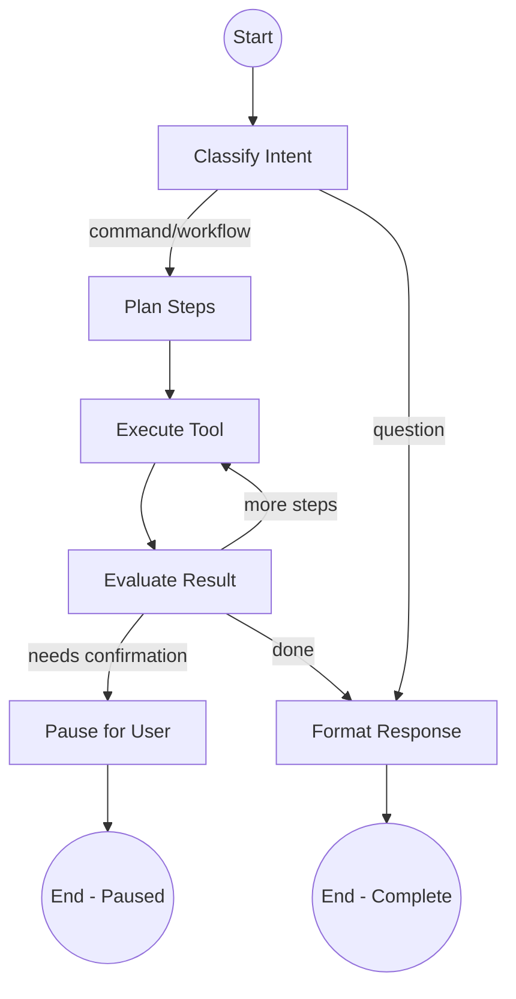

# 🧠 Orbit AI Agent — Python Implementation Blueprint

> **Production-grade plan for building an AI agent with Python, LangGraph, FastAPI, PostgreSQL, and OpenAI/Anthropic.**
> Created: 2026-02-16 | Status: Implementation Plan

---

## 1. High-Level Architecture

### System Overview

```
┌──────────────┐       ┌──────────────────────────────────────────────────┐       ┌──────────────┐
│   Telegram   │       │          Orbit AI Agent (Python)                 │       │   Desktop    │
│   User       │◄─────►│                                                  │◄─────►│   TUI        │
│              │       │  ┌──────────┐  ┌───────────┐  ┌──────────────┐  │       │  (Go/Shell)  │
└──────────────┘       │  │ FastAPI   │  │ LangGraph │  │ Tool Engine  │  │       └──────────────┘
                       │  │ Gateway   │  │ Agent     │  │              │  │
┌──────────────┐       │  │ REST +    │  │ State     │  │ Shell, Jira, │  │       ┌──────────────┐
│   NestJS     │◄─────►│  │ WebSocket │  │ Machine   │  │ Git, Email,  │  │       │  PostgreSQL  │
│   Bridge     │       │  └──────────┘  └───────────┘  │ VS Code      │  │       │  + pgvector  │
└──────────────┘       │                                └──────────────┘  │       └──────────────┘
                       └──────────────────────────────────────────────────┘
```

### Data Flow

```
1. User sends message via Telegram
2. NestJS Bridge receives it, forwards to Python agent (FastAPI REST/WebSocket)
3. LangGraph agent processes the intent:
   a. Classifies the request
   b. Plans multi-step workflow (if needed)
   c. Executes tools (shell via Desktop TUI, Jira API, Git CLI, etc.)
   d. Pauses for user input if confirmation needed
   e. Resumes on user response
4. Agent responds with results back through Bridge → Telegram
5. All conversations + state persisted in PostgreSQL
```

### Why Python Over TypeScript for the Agent?

| Factor | Python | TypeScript |
|--------|--------|------------|
| LangGraph maturity | ✅ Primary SDK, most examples | ⚠️ Secondary, fewer examples |
| ML/AI ecosystem | ✅ Native home (numpy, transformers) | ⚠️ Limited |
| LLM provider SDKs | ✅ First-class support (OpenAI, Anthropic, Gemini) | ✅ Good support |
| Your existing infra | ⚠️ New service to deploy | ✅ Lives in NestJS |
| Agent debugging tools | ✅ LangSmith, rich tracing | ⚠️ Fewer options |

**Decision**: Python agent as a separate microservice. NestJS Bridge communicates via HTTP/WebSocket.

---

## 2. Production Folder Structure

```
orbit-agent/                          # Root of the Python agent project
├── pyproject.toml                    # Project metadata, dependencies (using Poetry/uv)
├── .env.example                      # Environment variable template
├── .env                              # Local environment variables (gitignored)
├── alembic.ini                       # Alembic DB migration config
├── Dockerfile                        # Production Docker image
├── docker-compose.yml                # Local dev: agent + postgres + redis
├── Makefile                          # Common commands (dev, test, migrate, lint)
│
├── migrations/                       # Alembic database migrations
│   ├── env.py
│   └── versions/
│       └── 001_initial_schema.py
│
├── src/
│   ├── __init__.py
│   ├── main.py                       # FastAPI app entry point
│   ├── config.py                     # Pydantic Settings (env vars, secrets)
│   ├── dependencies.py               # FastAPI dependency injection
│   │
│   ├── api/                          # FastAPI route layer
│   │   ├── __init__.py
│   │   ├── router.py                 # Main API router
│   │   ├── v1/
│   │   │   ├── __init__.py
│   │   │   ├── agent.py              # POST /agent/invoke, WS /agent/stream
│   │   │   ├── health.py             # GET /health, GET /ready
│   │   │   ├── sessions.py           # CRUD for conversation sessions
│   │   │   └── tools.py              # GET /tools (list available tools)
│   │   └── middleware/
│   │       ├── __init__.py
│   │       ├── auth.py               # JWT/API-key verification (Bridge auth)
│   │       ├── rate_limit.py         # Per-user rate limiting
│   │       └── logging.py           # Request/response logging
│   │
│   ├── agent/                        # LangGraph agent core
│   │   ├── __init__.py
│   │   ├── graph.py                  # Main StateGraph definition
│   │   ├── state.py                  # TypedDict state schema
│   │   ├── nodes/                    # Graph nodes (each is a function)
│   │   │   ├── __init__.py
│   │   │   ├── classifier.py         # Classify intent (command, question, workflow)
│   │   │   ├── planner.py            # Plan multi-step execution
│   │   │   ├── executor.py           # Execute tools
│   │   │   ├── evaluator.py          # Evaluate results, decide next step
│   │   │   ├── context_retriever.py  # Retrieve context before LLM calls (RAG)
│   │   │   ├── responder.py          # Format final response
│   │   │   ├── human_input.py        # Pause for user confirmation
│   │   │   ├── error_handler.py      # Error recovery and fallback
│   │   │   └── parallel_executor.py  # Parallel tool execution node
│   │   ├── edges.py                  # Conditional edge logic
│   │   ├── subgraphs/                # Nested LangGraph graphs for complex workflows
│   │   │   ├── __init__.py
│   │   │   └── base.py               # Base subgraph builder
│   │   └── prompts/                  # System prompts (version-controlled)
│   │       ├── classifier.py
│   │       ├── planner.py
│   │       └── responder.py
│   │
│   ├── workflows/                    # Pre-built workflow templates
│   │   ├── __init__.py
│   │   ├── templates.py              # Workflow template base class
│   │   ├── fix_ticket.py             # Fix Jira ticket workflow
│   │   ├── code_review.py            # Code review workflow
│   │   └── deploy.py                 # Deployment workflow
│   │
│   ├── tools/                        # Agent tools (LangChain Tool subclasses)
│   │   ├── __init__.py
│   │   ├── base.py                   # OrbitBaseTool abstract class
│   │   ├── registry.py              # Tool discovery + registration
│   │   ├── shell.py                  # Execute shell commands via Desktop TUI
│   │   ├── file_ops.py               # Read/write/list files via Desktop TUI
│   │   ├── git.py                    # Git operations (branch, commit, push)
│   │   ├── jira.py                   # Jira API integration
│   │   ├── github.py                 # GitHub API integration
│   │   ├── email.py                  # Email send/read (Gmail API / SMTP)
│   │   ├── vscode.py                 # VS Code operations via CLI
│   │   └── browser.py               # Web scraping (Playwright)
│   │
│   ├── memory/                       # Conversation + long-term memory
│   │   ├── __init__.py
│   │   ├── checkpointer.py           # LangGraph PostgreSQL checkpointer
│   │   ├── conversation.py           # Conversation history manager
│   │   ├── summary.py               # Auto-summarize long conversations
│   │   ├── embeddings.py             # Embedding generation and storage
│   │   └── indexer.py                # Project and content indexing for RAG
│   │
│   ├── db/                           # Database layer
│   │   ├── __init__.py
│   │   ├── engine.py                 # SQLAlchemy async engine + session
│   │   ├── models.py                 # ORM models (sessions, messages, tool_calls)
│   │   └── repositories/
│   │       ├── __init__.py
│   │       ├── session_repo.py
│   │       ├── message_repo.py
│   │       └── tool_call_repo.py
│   │
│   ├── llm/                          # LLM provider abstraction
│   │   ├── __init__.py
│   │   ├── factory.py                # Create LLM by provider name
│   │   ├── openai.py                 # OpenAI ChatModel wrapper
│   │   ├── anthropic.py              # Anthropic ChatModel wrapper
│   │   └── gemini.py                 # Google Gemini ChatModel wrapper
│   │
│   ├── bridge/                       # NestJS Bridge communication client
│   │   ├── __init__.py
│   │   ├── client.py                 # HTTP/WS client to call Bridge
│   │   └── schemas.py               # Request/response Pydantic models
│   │
│   └── utils/                        # Shared utilities
│       ├── __init__.py
│       ├── safety.py                 # Command risk classification
│       ├── retry.py                  # Retry with exponential backoff
│       └── formatting.py            # Response formatting helpers
│
├── tests/
│   ├── conftest.py                   # Pytest fixtures (test DB, mock LLM)
│   ├── unit/
│   │   ├── test_classifier.py
│   │   ├── test_planner.py
│   │   ├── test_safety.py
│   │   └── test_tools.py
│   ├── integration/
│   │   ├── test_agent_flow.py
│   │   ├── test_api.py
│   │   └── test_db.py
│   └── e2e/
│       └── test_full_pipeline.py
│
└── scripts/
    ├── seed_db.py                    # Seed database with test data
    └── run_agent_cli.py              # CLI for testing agent without FastAPI
```

### Folder Explanations

| Folder | Purpose |
|--------|---------|
| `src/api/` | FastAPI routes — the HTTP/WebSocket interface the NestJS Bridge calls |
| `src/agent/` | LangGraph graph definition, nodes, edges — the "brain" |
| `src/agent/nodes/` | Each node is a pure function: `(state) → state`. Clean, testable |
| `src/agent/subgraphs/` | Nested LangGraph graphs for complex workflows |
| `src/agent/prompts/` | Version-controlled system prompts, separate from logic |
| `src/workflows/` | Pre-built workflow templates for common patterns |
| `src/tools/` | Each tool is a `BaseTool` subclass with `_run()` / `_arun()` |
| `src/memory/` | PostgreSQL-backed checkpointer for LangGraph + conversation history + embeddings |
| `src/db/` | SQLAlchemy async models + repository pattern for clean data access |
| `src/llm/` | Provider abstraction — swap OpenAI ↔ Anthropic ↔ Gemini without touching agent code |
| `src/bridge/` | HTTP client to communicate back to NestJS (send results, get desktop status) |
| `migrations/` | Alembic migrations for full schema version control |

---

## 3. LangGraph Core Concepts

### 3.1 State — The Agent's Working Memory

Everything the agent knows at any point in time lives in a single `TypedDict`:

```python
# src/agent/state.py
from typing import TypedDict, Annotated, Literal
from langgraph.graph.message import add_messages
from langchain_core.messages import BaseMessage

class AgentState(TypedDict):
    """The complete state of an Orbit agent execution."""
    # Conversation messages (LLM + tool results) — append-only via reducer
    messages: Annotated[list[BaseMessage], add_messages]

    # Current classification of user intent
    intent: Literal["command", "question", "workflow", "confirmation", "unknown"]

    # Multi-step plan (list of planned actions)
    plan: list[dict]          # [{"step": 1, "action": "run_shell", "args": {...}}, ...]
    current_step: int         # Index into plan

    # Tool execution results
    tool_results: list[dict]  # [{"tool": "shell", "output": "...", "success": True}, ...]

    # Control flow
    needs_confirmation: bool  # Pause for user input?
    confirmation_prompt: str  # What to ask the user
    is_complete: bool         # Should we exit the graph?

    # Metadata
    session_id: str
    user_id: str
    iteration_count: int      # Safety: max iterations guard
```

**Key concept**: `add_messages` is a **reducer** — when a node returns `{"messages": [new_msg]}`, it *appends* rather than replaces. This builds the conversation naturally.

### 3.2 Nodes — Functions That Transform State

Each node is a plain async function: `State in → State out`.

```python
# src/agent/nodes/classifier.py
from langchain_core.messages import SystemMessage, HumanMessage
from src.agent.state import AgentState
from src.agent.prompts.classifier import CLASSIFIER_PROMPT

async def classify_intent(state: AgentState, config) -> dict:
    """Classify what the user wants: command, question, workflow, etc."""
    llm = config["configurable"]["llm"]
    last_message = state["messages"][-1].content

    response = await llm.ainvoke([
        SystemMessage(content=CLASSIFIER_PROMPT),
        HumanMessage(content=f"Classify: {last_message}")
    ])

    intent = response.content.strip().lower()
    return {"intent": intent}
```

```python
# src/agent/nodes/planner.py
async def plan_execution(state: AgentState, config) -> dict:
    """Create a multi-step plan for complex requests."""
    llm = config["configurable"]["llm"]

    response = await llm.ainvoke(
        state["messages"] + [SystemMessage(content=PLANNER_PROMPT)]
    )

    plan = parse_plan(response.content)  # Extract structured plan
    return {"plan": plan, "current_step": 0}
```

```python
# src/agent/nodes/executor.py
async def execute_tool(state: AgentState, config) -> dict:
    """Execute the current step's tool."""
    step = state["plan"][state["current_step"]]
    tool_registry = config["configurable"]["tools"]

    tool = tool_registry.get(step["action"])
    result = await tool.ainvoke(step["args"])

    return {
        "tool_results": [{"tool": step["action"], "output": result, "success": True}],
        "current_step": state["current_step"] + 1,
        "iteration_count": state["iteration_count"] + 1,
    }
```

### 3.3 Edges — Routing Logic

```python
# src/agent/edges.py
from src.agent.state import AgentState

def route_after_classification(state: AgentState) -> str:
    """After classifying intent, decide where to go."""
    if state["intent"] == "command":
        return "planner"
    elif state["intent"] == "question":
        return "responder"       # Simple Q&A, no tools needed
    elif state["intent"] == "workflow":
        return "planner"
    elif state["intent"] == "confirmation":
        return "executor"        # User confirmed, resume execution
    return "responder"           # Fallback

def route_after_evaluation(state: AgentState) -> str:
    """After evaluating a tool result, decide: continue, confirm, or finish."""
    if state["iteration_count"] > 10:
        return "responder"       # Safety: max iterations
    if state["needs_confirmation"]:
        return "human_input"     # Pause and ask user
    if state["current_step"] < len(state["plan"]):
        return "executor"        # More steps to execute
    return "responder"           # All done
```

### 3.4 The Complete Graph

```python
# src/agent/graph.py
from langgraph.graph import StateGraph, END, START
from langgraph.checkpoint.postgres.aio import AsyncPostgresSaver
from src.agent.state import AgentState
from src.agent.nodes import classifier, planner, executor, evaluator, responder, human_input
from src.agent.edges import route_after_classification, route_after_evaluation

def build_agent_graph(checkpointer=None):
    """Build and compile the Orbit AI agent graph."""

    graph = StateGraph(AgentState)

    # --- Add Nodes ---
    graph.add_node("classifier", classifier.classify_intent)
    graph.add_node("planner", planner.plan_execution)
    graph.add_node("executor", executor.execute_tool)
    graph.add_node("evaluator", evaluator.evaluate_result)
    graph.add_node("responder", responder.format_response)
    graph.add_node("human_input", human_input.pause_for_input)

    # --- Add Edges ---
    graph.add_edge(START, "classifier")

    graph.add_conditional_edges("classifier", route_after_classification, {
        "planner": "planner",
        "responder": "responder",
    })

    graph.add_edge("planner", "executor")
    graph.add_edge("executor", "evaluator")

    graph.add_conditional_edges("evaluator", route_after_evaluation, {
        "executor": "executor",       # Continue plan
        "human_input": "human_input", # Pause for confirmation
        "responder": "responder",     # Done
    })

    graph.add_edge("human_input", END)  # Paused — resume on next invoke
    graph.add_edge("responder", END)

    return graph.compile(checkpointer=checkpointer)
```

### Execution Flow Diagram



---

## 4. Phased Implementation Plan

### Phase 1: Basic Agent — NLP → Shell (Weeks 1-2)

**Goal**: User says "which directory am I in?" → agent translates to `pwd` → executes → responds.

#### What to Build

1. **Project scaffolding** — `pyproject.toml`, FastAPI app, Docker setup
2. **`src/config.py`** — Pydantic Settings for env vars
3. **`src/llm/factory.py`** — LLM provider factory (OpenAI/Anthropic)
4. **`src/agent/state.py`** — Minimal state (messages + intent only)
5. **`src/agent/graph.py`** — Simple 2-node graph: `classify → respond`
6. **`src/tools/shell.py`** — Shell tool that calls Desktop TUI via Bridge
7. **`src/api/v1/agent.py`** — `POST /agent/invoke` endpoint
8. **`src/utils/safety.py`** — Command risk classifier
9. **`src/bridge/client.py`** — HTTP client to call NestJS Bridge

#### Minimal Agent Graph (Phase 1)

```
START → classify → (command? → execute_shell → respond) | (question? → respond)
```

#### Bridge Communication Contract

```python
# Python Agent → NestJS Bridge
POST /api/desktop/execute
{
    "sessionId": "abc-123",
    "command": "pwd",
    "timeout": 30000
}

# NestJS Bridge → Python Agent (response)
{
    "success": true,
    "output": "/home/ayan/Projects",
    "exitCode": 0
}
```

---

### Phase 2: Tools + Memory (Weeks 3-5)

**Goal**: Multi-step plans, conversation memory, tool registry.

#### What to Build

1. **`src/tools/registry.py`** — Auto-discover and register tools
2. **`src/tools/file_ops.py`** — Read/write/list files
3. **`src/agent/nodes/planner.py`** — Multi-step planning node
4. **`src/agent/nodes/executor.py`** — Generic tool executor
5. **`src/agent/nodes/evaluator.py`** — Result evaluation + re-planning
6. **`src/memory/checkpointer.py`** — PostgreSQL checkpointer for LangGraph
7. **`src/memory/conversation.py`** — Session-scoped conversation history
8. **Full StateGraph** with conditional edges
9. **WebSocket streaming** — `WS /agent/stream` for real-time progress

#### Memory Schema (PostgreSQL)

```sql
CREATE TABLE agent_sessions (
    id UUID PRIMARY KEY DEFAULT gen_random_uuid(),
    user_id UUID NOT NULL REFERENCES users(id),
    created_at TIMESTAMPTZ DEFAULT NOW(),
    updated_at TIMESTAMPTZ DEFAULT NOW(),
    metadata JSONB DEFAULT '{}'
);

CREATE TABLE agent_messages (
    id UUID PRIMARY KEY DEFAULT gen_random_uuid(),
    session_id UUID NOT NULL REFERENCES agent_sessions(id),
    role VARCHAR(20) NOT NULL,  -- 'user', 'assistant', 'tool', 'system'
    content TEXT NOT NULL,
    tool_calls JSONB,           -- If role='assistant' and it called tools
    tool_call_id VARCHAR(100),  -- If role='tool', which call this responds to
    created_at TIMESTAMPTZ DEFAULT NOW()
);

CREATE TABLE agent_tool_calls (
    id UUID PRIMARY KEY DEFAULT gen_random_uuid(),
    session_id UUID NOT NULL REFERENCES agent_sessions(id),
    message_id UUID REFERENCES agent_messages(id),
    tool_name VARCHAR(100) NOT NULL,
    arguments JSONB NOT NULL,
    result JSONB,
    status VARCHAR(20) DEFAULT 'pending',  -- pending, running, success, error
    duration_ms INTEGER,
    created_at TIMESTAMPTZ DEFAULT NOW()
);
```

---

### Phase 3: Jira + Git + Email Tools (Weeks 6-9)

**Goal**: Agent connects to external services.

#### Tools to Build

| Tool | File | Key Methods |
|------|------|-------------|
| **Jira** | `src/tools/jira.py` | `get_my_tickets()`, `get_ticket(key)`, `update_status(key, status)` |
| **Git** | `src/tools/git.py` | `status()`, `checkout_branch(name)`, `commit(msg)`, `push()` |
| **GitHub** | `src/tools/github.py` | `list_prs(repo)`, `get_pr(number)`, `create_pr(title, body)` |
| **Email** | `src/tools/email.py` | `send_email(to, subject, body)`, `read_inbox(count)` |
| **VS Code** | `src/tools/vscode.py` | `open_project(path)`, `open_file(path)` |
| **Browser** | `src/tools/browser.py` | `scrape(url)`, `screenshot(url)`, `navigate(url)` |

#### Human-in-the-Loop for Dangerous Actions

```python
# src/agent/nodes/human_input.py
async def pause_for_input(state: AgentState, config) -> dict:
    """Pause execution and ask user for confirmation."""
    return {
        "needs_confirmation": True,
        "confirmation_prompt": f"⚠️ I'm about to: {state['plan'][state['current_step']]}. Proceed?",
        "is_complete": False,  # Graph pauses here — resumed on next invoke
    }
```

When the user responds "yes", the Bridge re-invokes the agent with the same `thread_id` (session), and LangGraph **resumes from the checkpoint**.

---

### Phase 4: Memory + RAG (Weeks 10-13)

**Goal**: Agent remembers past sessions, knows your projects.

#### What to Build

1. **`src/memory/summary.py`** — Auto-summarize long conversations
2. **pgvector extension** — semantic search over indexed data
3. **Project indexer** — index file trees, README, package.json
4. **Context retrieval node** — inject relevant context before LLM calls

#### Context Retrieval Node

```python
# src/agent/nodes/context_retriever.py
from typing import Optional
from src.agent.state import AgentState
from src.memory.embeddings import EmbeddingService
from langchain_core.messages import SystemMessage

async def retrieve_context(state: AgentState, config) -> dict:
    """Retrieve relevant context from embeddings before LLM calls."""
    embedding_service: EmbeddingService = config["configurable"]["embedding_service"]
    last_message = state["messages"][-1].content

    # Search for relevant context
    context = await embedding_service.search(
        query=last_message,
        user_id=state["user_id"],
        limit=5
    )

    if context:
        # Inject context as a system message
        context_str = "\n".join([c["content"] for c in context])
        return {
            "messages": [SystemMessage(
                content=f"Relevant context:\n{context_str}"
            )]
        }
    return {}
```

#### Embedding Service

```python
# src/memory/embeddings.py
from typing import List
from openai import AsyncOpenAI
import asyncpg
from src.config import settings

class EmbeddingService:
    def __init__(self):
        self.client = AsyncOpenAI(api_key=settings.OPENAI_API_KEY)
        self.db_url = settings.DATABASE_URL

    async def generate_embedding(self, text: str) -> List[float]:
        """Generate embedding for text using OpenAI."""
        response = await self.client.embeddings.create(
            model="text-embedding-3-small",
            input=text
        )
        return response.data[0].embedding

    async def store(self, user_id: str, source: str, content: str, metadata: dict):
        """Generate and store an embedding."""
        embedding = await self.generate_embedding(content)
        async with asyncpg.connect(self.db_url) as conn:
            await conn.execute(
                """INSERT INTO embeddings (user_id, source, content, metadata, embedding)
                   VALUES ($1, $2, $3, $4, $5)""",
                user_id, source, content, metadata, embedding
            )

    async def search(self, query: str, user_id: str, limit: int = 5) -> List[dict]:
        """Search for relevant embeddings."""
        query_embedding = await self.generate_embedding(query)
        async with asyncpg.connect(self.db_url) as conn:
            rows = await conn.fetch(
                """SELECT content, metadata, 1 - (embedding <=> $1) as similarity
                   FROM embeddings
                   WHERE user_id = $2
                   ORDER BY embedding <=> $1
                   LIMIT $3""",
                query_embedding, user_id, limit
            )
            return [{"content": r["content"], "metadata": r["metadata"],
                    "similarity": r["similarity"]} for r in rows]
```

#### Project Indexer

```python
# src/memory/indexer.py
from pathlib import Path
from src.memory.embeddings import EmbeddingService
from src.config import settings

class ProjectIndexer:
    def __init__(self, embedding_service: EmbeddingService):
        self.embedding_service = embedding_service

    async def index_directory(self, project_path: str, user_id: str):
        """Index all files in a project directory."""
        path = Path(project_path)
        for file_path in path.rglob("*.py"):
            content = file_path.read_text()
            await self.embedding_service.store(
                user_id=user_id,
                source="project",
                content=content,
                metadata={
                    "project": project_path,
                    "file": str(file_path),
                    "file_type": "code"
                }
            )

        # Index README if exists
        readme_path = path / "README.md"
        if readme_path.exists():
            content = readme_path.read_text()
            await self.embedding_service.store(
                user_id=user_id,
                source="project",
                content=content,
                metadata={
                    "project": project_path,
                    "file": str(readme_path),
                    "file_type": "readme"
                }
            )
```

```sql
-- Add to existing PostgreSQL
CREATE EXTENSION IF NOT EXISTS vector;

CREATE TABLE embeddings (
    id UUID PRIMARY KEY DEFAULT gen_random_uuid(),
    user_id UUID NOT NULL,
    source VARCHAR(50) NOT NULL,  -- 'project', 'email', 'jira'
    content TEXT NOT NULL,
    metadata JSONB DEFAULT '{}',
    embedding vector(1536),       -- OpenAI text-embedding-3-small dimension
    created_at TIMESTAMPTZ DEFAULT NOW()
);

CREATE INDEX ON embeddings USING ivfflat (embedding vector_cosine_ops) WITH (lists = 100);
```

---

### Phase 5: Autonomous Workflows (Weeks 14-16)

**Goal**: Agent executes full workflows end-to-end (e.g., "fix PROJ-123 and push").

- **Workflow templates** — pre-built graphs for common patterns
- **Sub-graphs** — nested LangGraph graphs for complex tool chains
- **Error recovery** — automatic retry, rollback, human fallback
- **Parallel tool execution** — run independent steps concurrently

#### Workflow Template System

```python
# src/workflows/templates.py
from abc import ABC, abstractmethod
from langgraph.graph import StateGraph
from src.agent.state import AgentState

class WorkflowTemplate(ABC):
    """Base class for workflow templates."""

    @abstractmethod
    def build_graph(self) -> StateGraph:
        """Build the LangGraph for this workflow."""
        pass

    @abstractmethod
    def get_name(self) -> str:
        """Return the workflow name."""
        pass
```

#### Fix Jira Ticket Workflow

```python
# src/workflows/fix_ticket.py
from src.workflows.templates import WorkflowTemplate
from langgraph.graph import StateGraph, START, END

class FixTicketWorkflow(WorkflowTemplate):
    def get_name(self) -> str:
        return "fix_ticket"

    def build_graph(self) -> StateGraph:
        graph = StateGraph(AgentState)
        graph.add_node("fetch_ticket", fetch_ticket_details)
        graph.add_node("checkout_branch", create_fix_branch)
        graph.add_node("analyze_and_fix", analyze_and_apply_fix)
        graph.add_node("run_tests", test_fix)
        graph.add_node("commit", commit_fix)
        graph.add_node("push", push_changes)
        graph.add_node("update_jira", close_ticket)

        graph.add_edge(START, "fetch_ticket")
        graph.add_edge("fetch_ticket", "checkout_branch")
        graph.add_edge("checkout_branch", "analyze_and_fix")
        graph.add_conditional_edges("analyze_and_fix", should_test, {
            "test": "run_tests", "skip": "commit"
        })
        graph.add_edge("run_tests", "commit")
        graph.add_edge("commit", "push")
        graph.add_edge("push", "update_jira")
        graph.add_edge("update_jira", END)

        return graph.compile()
```

#### Error Handler Node

```python
# src/agent/nodes/error_handler.py
from src.agent.state import AgentState
from src.utils.retry import RetryConfig

async def handle_error(state: AgentState, config) -> dict:
    """Handle errors with retry, fallback, or human intervention."""
    last_error = state.get("last_error")

    if not last_error:
        return {}

    retry_config: RetryConfig = config["configurable"].get("retry_config")
    current_retries = state.get("retry_count", 0)

    if current_retries < retry_config.max_retries:
        # Retry the current step
        return {
            "retry_count": current_retries + 1,
            "messages": [SystemMessage(content=f"Retrying... Attempt {current_retries + 1}")]
        }

    # Max retries reached - escalate to human
    return {
        "needs_confirmation": True,
        "confirmation_prompt": f"⚠️ Error after {current_retries} retries: {last_error}. Please provide guidance or abort.",
        "is_complete": False
    }
```

#### Parallel Executor

```python
# src/agent/nodes/parallel_executor.py
from typing import List
import asyncio
from src.agent.state import AgentState

async def execute_parallel_tools(state: AgentState, config) -> dict:
    """Execute independent tools in parallel."""
    parallel_steps = state.get("parallel_steps", [])
    tool_registry = config["configurable"]["tools"]

    # Execute all tools in parallel
    tasks = []
    for step in parallel_steps:
        tool = tool_registry.get(step["action"])
        tasks.append(tool.ainvoke(step["args"]))

    results = await asyncio.gather(*tasks, return_exceptions=True)

    tool_results = []
    for step, result in zip(parallel_steps, results):
        if isinstance(result, Exception):
            tool_results.append({
                "tool": step["action"],
                "success": False,
                "error": str(result)
            })
        else:
            tool_results.append({
                "tool": step["action"],
                "success": True,
                "output": result
            })

    return {"tool_results": tool_results}
```

#### Sub-Graph System

```python
# src/agent/subgraphs/base.py
from langgraph.graph import StateGraph
from src.agent.state import AgentState

def build_fix_ticket_subgraph() -> StateGraph:
    """Build a sub-graph for fixing Jira tickets."""
    from src.workflows.fix_ticket import FixTicketWorkflow
    workflow = FixTicketWorkflow()
    return workflow.build_graph()

def build_code_review_subgraph() -> StateGraph:
    """Build a sub-graph for code reviews."""
    graph = StateGraph(AgentState)
    graph.add_node("fetch_pr", fetch_pull_request)
    graph.add_node("analyze_code", analyze_code_changes)
    graph.add_node("post_review", post_review_comment)
    # ... wire edges ...
    return graph.compile()
```

---

## 5. Tool Architecture Pattern

### Base Tool Pattern

Every tool follows the same contract:

```python
# src/tools/base.py
from abc import ABC, abstractmethod
from langchain_core.tools import BaseTool
from pydantic import BaseModel, Field

class OrbitToolResult(BaseModel):
    """Standardized result from any Orbit tool."""
    success: bool
    output: str
    error: str | None = None
    metadata: dict = Field(default_factory=dict)

class OrbitBaseTool(BaseTool, ABC):
    """Base class for all Orbit agent tools."""

    # Every tool must declare its risk level
    risk_level: str = "low"  # low, medium, high, critical

    @abstractmethod
    async def _arun(self, **kwargs) -> OrbitToolResult:
        """Async execution — all tools must implement this."""
        ...

    def requires_confirmation(self) -> bool:
        """Whether this tool needs human approval before running."""
        return self.risk_level in ("high", "critical")
```

### Concrete Tool Example — Shell

```python
# src/tools/shell.py
from langchain_core.tools import tool
from pydantic import BaseModel, Field
from src.bridge.client import BridgeClient
from src.utils.safety import classify_command_risk

class ShellInput(BaseModel):
    command: str = Field(description="The shell command to execute")
    working_dir: str | None = Field(default=None, description="Working directory")

@tool("run_shell_command", args_schema=ShellInput)
async def run_shell_command(command: str, working_dir: str | None = None) -> str:
    """Execute a shell command on the connected desktop machine.
    Use this for file operations, system info, running scripts, etc.
    NEVER use for destructive commands without confirmation."""

    risk = classify_command_risk(command)
    if risk in ("high", "critical"):
        return f"⚠️ BLOCKED: '{command}' is {risk}-risk. Needs user confirmation."

    client = BridgeClient()
    result = await client.execute_command(command, working_dir)

    if result["success"]:
        return result["output"]
    return f"❌ Command failed (exit {result['exitCode']}): {result['output']}"
```

### Concrete Tool Example — Jira

```python
# src/tools/jira.py
from langchain_core.tools import tool
from pydantic import BaseModel, Field
import httpx

JIRA_BASE = "https://your-domain.atlassian.net/rest/api/3"

class JiraGetTicketInput(BaseModel):
    ticket_key: str = Field(description="Jira ticket key, e.g. PROJ-123")

@tool("jira_get_ticket", args_schema=JiraGetTicketInput)
async def jira_get_ticket(ticket_key: str) -> str:
    """Fetch details of a Jira ticket by its key."""
    async with httpx.AsyncClient() as client:
        resp = await client.get(
            f"{JIRA_BASE}/issue/{ticket_key}",
            headers={"Authorization": f"Basic {JIRA_TOKEN}"},
        )
        data = resp.json()
        return (
            f"**{data['key']}**: {data['fields']['summary']}\n"
            f"Status: {data['fields']['status']['name']}\n"
            f"Assignee: {data['fields']['assignee']['displayName']}\n"
            f"Description: {data['fields']['description']}"
        )
```

### Tool Registry

```python
# src/tools/registry.py
from src.tools.shell import run_shell_command
from src.tools.jira import jira_get_ticket, jira_get_my_tickets, jira_update_status
from src.tools.git import git_status, git_checkout, git_commit, git_push
from src.tools.email import send_email, read_inbox
from src.tools.github import list_prs, create_pr

def get_all_tools() -> list:
    """Return all available tools for the agent."""
    return [
        run_shell_command,
        jira_get_ticket,
        jira_get_my_tickets,
        jira_update_status,
        git_status,
        git_checkout,
        git_commit,
        git_push,
        send_email,
        read_inbox,
        list_prs,
        create_pr,
    ]

def get_tools_by_phase(phase: int) -> list:
    """Return tools available at a given implementation phase."""
    phase_map = {
        1: [run_shell_command],
        2: [run_shell_command],  # + file_ops
        3: [run_shell_command, jira_get_ticket, git_status, send_email],
    }
    return phase_map.get(phase, get_all_tools())
```

---

## 6. PostgreSQL Memory Integration

### LangGraph Checkpointer (Pause/Resume)

```python
# src/memory/checkpointer.py
from langgraph.checkpoint.postgres.aio import AsyncPostgresSaver

async def get_checkpointer(db_url: str) -> AsyncPostgresSaver:
    """Create a PostgreSQL-backed checkpointer for LangGraph.
    This enables: pause/resume, conversation history, state recovery."""
    checkpointer = AsyncPostgresSaver.from_conn_string(db_url)
    await checkpointer.setup()  # Creates required tables automatically
    return checkpointer
```

### Using the Checkpointer

```python
# Every invocation uses a thread_id (= session_id)
config = {"configurable": {"thread_id": session_id}}

# First message
result = await agent.ainvoke(
    {"messages": [HumanMessage(content="check my Jira tickets")]},
    config=config,
)

# Agent pauses for confirmation → user says "yes" →
# Resume with SAME thread_id — LangGraph loads state from PostgreSQL
result = await agent.ainvoke(
    {"messages": [HumanMessage(content="yes, proceed")]},
    config=config,
)
```

### Conversation Memory Service

```python
# src/memory/conversation.py
from sqlalchemy.ext.asyncio import AsyncSession
from src.db.models import AgentMessage, AgentSession

class ConversationMemory:
    def __init__(self, db: AsyncSession):
        self.db = db

    async def get_history(self, session_id: str, limit: int = 50) -> list[dict]:
        """Load recent conversation history for context."""
        messages = await self.db.execute(
            select(AgentMessage)
            .where(AgentMessage.session_id == session_id)
            .order_by(AgentMessage.created_at.desc())
            .limit(limit)
        )
        return [{"role": m.role, "content": m.content} for m in messages.scalars()]

    async def save_message(self, session_id: str, role: str, content: str):
        """Persist a message to the database."""
        msg = AgentMessage(session_id=session_id, role=role, content=content)
        self.db.add(msg)
        await self.db.commit()
```

---

## 7. FastAPI Service Integration

### Main Application

```python
# src/main.py
from fastapi import FastAPI
from fastapi.middleware.cors import CORSMiddleware
from contextlib import asynccontextmanager
from src.api.router import api_router
from src.config import settings
from src.db.engine import init_db
from src.memory.checkpointer import get_checkpointer
from src.agent.graph import build_agent_graph

@asynccontextmanager
async def lifespan(app: FastAPI):
    """Startup: init DB, build agent graph. Shutdown: cleanup."""
    await init_db()
    checkpointer = await get_checkpointer(settings.DATABASE_URL)
    app.state.agent = build_agent_graph(checkpointer=checkpointer)
    yield
    # Shutdown cleanup

app = FastAPI(title="Orbit AI Agent", version="1.0.0", lifespan=lifespan)
app.add_middleware(CORSMiddleware, allow_origins=["*"], allow_methods=["*"])
app.include_router(api_router, prefix="/api/v1")
```

### Agent Invoke Endpoint

```python
# src/api/v1/agent.py
from fastapi import APIRouter, Depends, Request
from pydantic import BaseModel
from langchain_core.messages import HumanMessage

router = APIRouter(prefix="/agent", tags=["agent"])

class InvokeRequest(BaseModel):
    session_id: str
    user_id: str
    message: str

class InvokeResponse(BaseModel):
    response: str
    tool_calls: list[dict] = []
    needs_confirmation: bool = False
    confirmation_prompt: str | None = None

@router.post("/invoke", response_model=InvokeResponse)
async def invoke_agent(req: InvokeRequest, request: Request):
    """Invoke the agent with a user message. Supports pause/resume via session_id."""
    agent = request.app.state.agent
    config = {"configurable": {"thread_id": req.session_id}}

    result = await agent.ainvoke(
        {"messages": [HumanMessage(content=req.message)],
         "session_id": req.session_id, "user_id": req.user_id},
        config=config,
    )

    last_msg = result["messages"][-1].content
    return InvokeResponse(
        response=last_msg,
        needs_confirmation=result.get("needs_confirmation", False),
        confirmation_prompt=result.get("confirmation_prompt"),
    )
```

### WebSocket Streaming

```python
# src/api/v1/agent.py (continued)
from fastapi import WebSocket
from langchain_core.messages import HumanMessage

@router.websocket("/stream")
async def stream_agent(websocket: WebSocket):
    """Stream agent execution progress in real-time."""
    await websocket.accept()
    agent = websocket.app.state.agent

    while True:
        data = await websocket.receive_json()
        config = {"configurable": {"thread_id": data["session_id"]}}

        async for event in agent.astream_events(
            {"messages": [HumanMessage(content=data["message"])]},
            config=config,
            version="v2",
        ):
            if event["event"] == "on_chat_model_stream":
                await websocket.send_json({
                    "type": "token", "content": event["data"]["chunk"].content
                })
            elif event["event"] == "on_tool_start":
                await websocket.send_json({
                    "type": "tool_start", "tool": event["name"]
                })
            elif event["event"] == "on_tool_end":
                await websocket.send_json({
                    "type": "tool_end", "tool": event["name"],
                    "output": str(event["data"].content)
                })

        await websocket.send_json({"type": "done"})
```

### NestJS Bridge ↔ Python Agent Contract

| Endpoint | Method | Direction | Purpose |
|----------|--------|-----------|---------|
| `/api/v1/agent/invoke` | POST | Bridge → Agent | Send user message, get response |
| `/api/v1/agent/stream` | WS | Bridge → Agent | Real-time streaming |
| `/api/v1/health` | GET | Bridge → Agent | Health check |
| `/api/v1/sessions` | GET/POST | Bridge → Agent | Manage sessions |
| `/api/desktop/execute` | POST | Agent → Bridge | Execute shell cmd on desktop |

### Bridge Client & Schemas

```python
# src/bridge/client.py
import httpx
from src.config import settings
from src.bridge.schemas import ExecuteCommandRequest, ExecuteCommandResponse

class BridgeClient:
    """HTTP client to communicate with the NestJS Bridge."""

    def __init__(self):
        self.base_url = settings.BRIDGE_URL
        self.timeout = 30.0

    async def execute_command(
        self,
        command: str,
        working_dir: str | None = None,
        timeout: int = 30000
    ) -> ExecuteCommandResponse:
        """Execute a shell command on the desktop via Bridge."""
        request = ExecuteCommandRequest(
            session_id="",  # Set by caller
            command=command,
            working_dir=working_dir,
            timeout=timeout
        )

        async with httpx.AsyncClient() as client:
            response = await client.post(
                f"{self.base_url}/api/desktop/execute",
                json=request.model_dump(),
                timeout=self.timeout
            )
            return ExecuteCommandResponse(**response.json())

    async def get_desktop_status(self) -> dict:
        """Get the status of the desktop TUI."""
        async with httpx.AsyncClient() as client:
            response = await client.get(
                f"{self.base_url}/api/desktop/status",
                timeout=10.0
            )
            return response.json()
```

```python
# src/bridge/schemas.py
from pydantic import BaseModel, Field

class ExecuteCommandRequest(BaseModel):
    """Request to execute a command on the desktop."""
    session_id: str = Field(..., description="Session ID for tracking")
    command: str = Field(..., description="Shell command to execute")
    working_dir: str | None = Field(default=None, description="Working directory")
    timeout: int = Field(default=30000, description="Timeout in milliseconds")

class ExecuteCommandResponse(BaseModel):
    """Response from command execution."""
    success: bool = Field(..., description="Whether command succeeded")
    output: str = Field(..., description="Command stdout/stderr output")
    exit_code: int = Field(..., description="Process exit code")
    duration_ms: int | None = Field(default=None, description="Execution duration")

class DesktopStatusResponse(BaseModel):
    """Desktop TUI status."""
    status: str = Field(..., description="Connection status")
    user: str | None = Field(default=None, description="Current user")
    hostname: str | None = Field(default=None, description="Hostname")
```

---

## 8. Learning Roadmap

### Stage 1: Python Foundations (3-5 days)

| Topic | Resource | Why |
|-------|----------|-----|
| Python async/await | [Real Python AsyncIO](https://realpython.com/async-io-python/) | FastAPI + LangGraph are async-first |
| Type hints & Pydantic | [Pydantic v2 docs](https://docs.pydantic.dev/latest/) | Data validation everywhere |
| SQLAlchemy async | [SQLAlchemy async tutorial](https://docs.sqlalchemy.org/en/20/orm/extensions/asyncio.html) | PostgreSQL ORM layer |

### Stage 2: FastAPI (3-5 days)

| Topic | Resource | Why |
|-------|----------|-----|
| FastAPI basics | [FastAPI Tutorial](https://fastapi.tiangolo.com/tutorial/) | Your API gateway |
| Dependency injection | FastAPI DI docs | Clean service wiring |
| WebSocket | FastAPI WS guide | Streaming agent responses |

### Stage 3: LangChain + LangGraph (1-2 weeks)

| Topic | Resource | Why |
|-------|----------|-----|
| LangChain basics | [LangChain Python docs](https://python.langchain.com/docs/) | Tool definitions, LLM wrappers |
| LangGraph fundamentals | [LangGraph docs](https://langchain-ai.github.io/langgraph/) | Your agent architecture |
| Tool calling | LangChain tools guide | Connecting LLM to your tools |
| Checkpointing | LangGraph persistence docs | Pause/resume, memory |
| Human-in-the-loop | LangGraph HITL guide | User confirmation flows |

### Stage 4: Agent Design Patterns (1 week)

| Topic | Resource | Why |
|-------|----------|-----|
| ReAct pattern | LangGraph ReAct tutorial | Reason + Act loop |
| Multi-agent patterns | LangGraph multi-agent docs | Sub-graphs for complex workflows |
| Prompt engineering | OpenAI + Anthropic guides | Effective system prompts |
| Error handling | LangGraph error handling | Graceful failures |

---

## 9. Dependencies

```toml
# pyproject.toml
[project]
name = "orbit-agent"
version = "0.1.0"
requires-python = ">=3.11"

dependencies = [
    # Core
    "fastapi>=0.115.0",
    "uvicorn[standard]>=0.30.0",
    "pydantic>=2.9.0",
    "pydantic-settings>=2.5.0",

    # LangChain + LangGraph
    "langgraph>=0.2.0",
    "langchain-core>=0.3.0",
    "langchain-openai>=0.2.0",
    "langchain-anthropic>=0.2.0",
    "langgraph-checkpoint-postgres>=2.0.0",

    # Database
    "sqlalchemy[asyncio]>=2.0.0",
    "asyncpg>=0.29.0",
    "alembic>=1.13.0",

    # HTTP client (for Bridge + external APIs)
    "httpx>=0.27.0",

    # Browser automation (for web scraping)
    "playwright>=1.48.0",

    # Utilities
    "python-dotenv>=1.0.0",
    "structlog>=24.0.0",
]

[project.optional-dependencies]
dev = [
    "pytest>=8.0",
    "pytest-asyncio>=0.24.0",
    "ruff>=0.6.0",
    "mypy>=1.11.0",
]
```

---

## 10. Estimated Timeline & Best Practices

### Timeline

| Phase | Weeks | Deliverable |
|-------|-------|-------------|
| **1. Basic Agent** | 1-2 | NLP → shell command, FastAPI running, Bridge connected |
| **2. Tools + Memory** | 3-5 | Multi-step plans, PostgreSQL memory, streaming |
| **3. Jira, Git, Email** | 6-9 | External service tools, human-in-the-loop |
| **4. RAG + Context** | 10-13 | pgvector search, project indexing |
| **5. Autonomous Workflows** | 14-17 | Templates, sub-graphs, error recovery |
| **6. Testing Suite** | 18-20 | Comprehensive test coverage (unit, integration, e2e) |
| **7. Documentation & CLI** | 21-22 | Complete docs and developer tooling |
| **8. DevOps & CI/CD** | 23-24 | Automated testing, building, deployment pipeline |

**Total: ~24 weeks to production-ready agent**

### Best Practices

| Category | Practice |
|----------|----------|
| **Safety** | Always classify command risk. Never auto-execute `rm`, `sudo`, `git push` without confirmation |
| **Observability** | Use LangSmith for tracing every LLM call + tool execution. Log structured JSON |
| **Cost control** | Use `gpt-4o-mini` for classification/simple tasks, `gpt-4o`/`claude-sonnet` for planning |
| **Testing** | Mock LLM responses in unit tests. Integration tests with real DB. E2E tests for full flows |
| **Prompts** | Version-control all system prompts. Never inline them in code |
| **Idempotency** | Tools should be safe to retry (e.g., `git push` if already pushed = no-op) |
| **Max iterations** | Cap agent loops at 10-15 steps. Timeout per tool at 30s |
| **Error handling** | Every tool returns `OrbitToolResult` with `success` flag. Agent can recover from failures |
| **Secrets** | Use env vars via `pydantic-settings`. Never hardcode API keys |
| **Deployment** | Docker container on Railway/Fly.io alongside your NestJS Bridge |

---

> **TL;DR**: Build a Python FastAPI microservice that hosts a LangGraph state-machine agent. The NestJS Bridge sends user messages via REST/WebSocket. The agent classifies intent, plans multi-step workflows, executes tools (shell, Jira, Git, email), pauses for confirmations, and persists everything in PostgreSQL. Start with Phase 1 (simple NLP → shell), and iterate.
